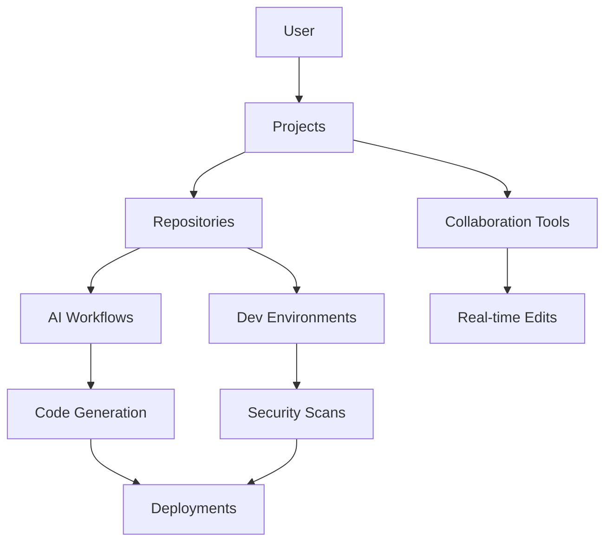

## Overview

Riven provides a unified platform where you build, collaborate, and innovate using AI-powered tools. Core concepts include projects that organize repositories, AI workflows that automate development tasks, collaboration features for team coordination, and secure dev environments that protect your code.

These elements work together to streamline your developer experience. Projects serve as containers for repositories, AI enhances coding efficiency, collaboration keeps teams aligned, and security ensures safe deployments.

<Columns cols={2}>
  <Card title="Projects & Repositories" icon="git-branch" href="/concepts/projects">
    Organize your codebases into projects that span multiple repositories for better management.
  </Card>
  <Card title="AI Workflows" icon="zap" href="/concepts/ai">
    Leverage AI to generate code, review changes, and automate routine tasks.
  </Card>
  <Card title="Collaboration Tools" icon="users" href="/concepts/collaboration">
    Real-time editing, comments, and approvals keep your team in sync.
  </Card>
  <Card title="Dev Environments & Security" icon="shield" href="/concepts/security">
    Instant environments with built-in security scanning and access controls.
  </Card>
</Columns>

## Architecture

Riven's architecture centers on a modular design that integrates AI services, repositories, and collaboration layers.



This flow ensures seamless interaction between components.

<Callout kind="info">
  Customize your architecture based on team size and project needs.
</Callout>

## AI-Powered Workflows

AI workflows in Riven automate code creation, testing, and optimization. You define workflows via configuration files that trigger on events like pushes or pulls.

<Tabs>
  <Tab title="Code Generation" icon="code">
    Generate boilerplate code instantly.

    <CodeGroup tabs="JavaScript,Python">
      ```javascript
      // .riven/workflows/generate.js
      module.exports = async ({ repo, prompt }) => {
        const response = await fetch('https://api.example.com/ai/generate', {
          method: 'POST',
          headers: { 'Authorization': `Bearer ${YOUR_API_KEY}` },
          body: JSON.stringify({ prompt, repo })
        });
        return response.json();
      };
      ```
      ```python
      # .riven/workflows/generate.py
      import requests

      def generate(repo, prompt):
          response = requests.post(
              'https://api.example.com/ai/generate',
              headers={'Authorization': f'Bearer {YOUR_API_KEY}'},
              json={'prompt': prompt, 'repo': repo}
          )
          return response.json()
      ```
    </CodeGroup>
  </Tab>
  <Tab title="Auto-Review" icon="eye">
    AI reviews pull requests for issues.

    ```javascript
    // Trigger on PR open
    if (event === 'pull_request.opened') {
      await riven.ai.review(prNumber);
    }
    ```
  </Tab>
</Tabs>

## Collaboration Tools

Use Riven's tools for seamless team work. Track progress with visual boards.

<Board title="Sample Collaboration Workflow">
  <BoardColumn title="Planning" color="0" icon="calendar">
    <BoardCard title="Define project scope" description="Outline requirements and milestones" dueDate="2024-12-15" author="Alice" />
  </BoardColumn>
  <BoardColumn title="Development" color="1" icon="code">
    <BoardCard title="Implement core features" description="Build AI integration" icon="zap" />
    <BoardCard title="Add tests" author="Bob" />
  </BoardColumn>
  <BoardColumn title="Review & Deploy" color="2" icon="check-circle">
    <BoardCard title="Peer review PR" createdAt="2024-12-20" />
    <BoardCard title="Deploy to staging" />
  </BoardColumn>
</Board>

## Dev Environments and Security Model

Set up secure dev environments with one command. Riven provisions isolated spaces with full repository access.

<Steps>
  <Step title="Create Environment" icon="terminal">
    ```bash
    riven env create my-project --repo my-repo --size medium
    ```
  </Step>
  <Step title="Configure Security" icon="shield">
    Enable scans in your project settings.
  </Step>
  <Step title="Collaborate Safely" icon="users">
    Share access with role-based permissions.
  </Step>
</Steps>

<Callout kind="tip">
  Always use least-privilege access for environments.
</Callout>

<Expandable title="Advanced Security Configuration" default-open="false">
  Customize scans with:

  ```yaml
  security:
    scans:
      vulnerabilities: true
      secrets: true
    thresholds:
      high: alert
      medium: warn
  ```
</Expandable>

These concepts form the foundation of Riven. Explore projects to start building.